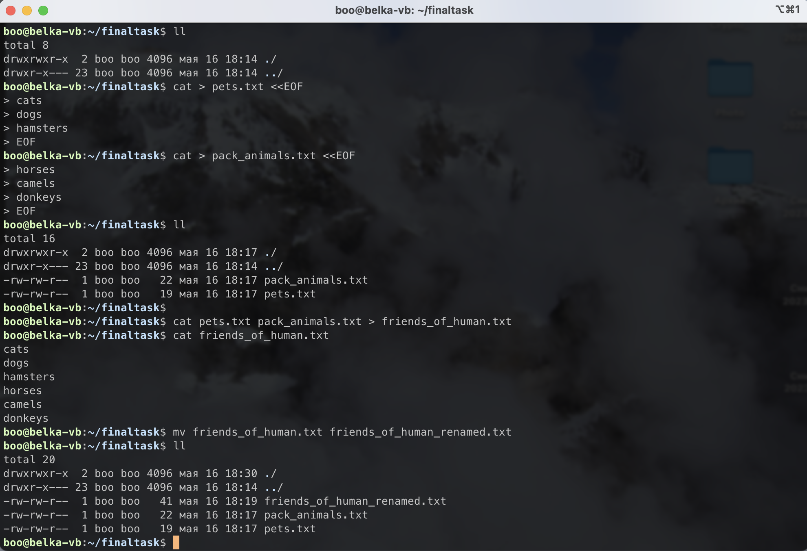
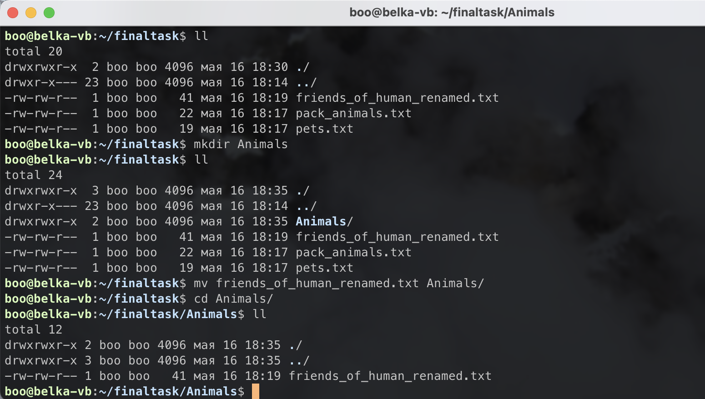
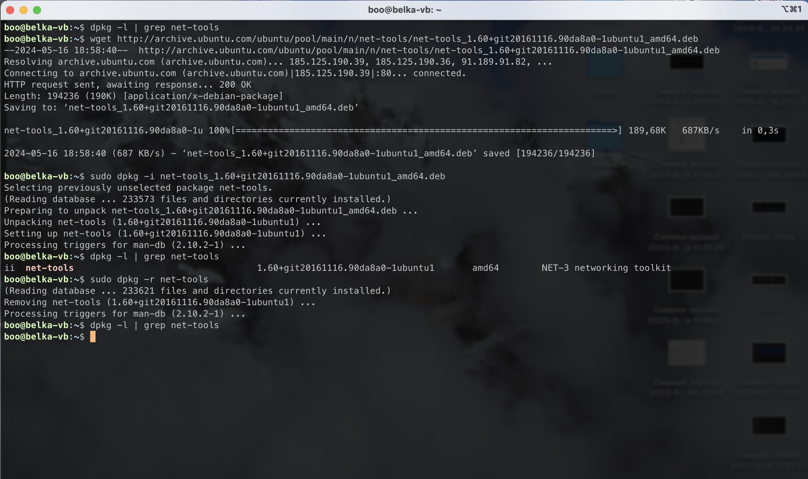
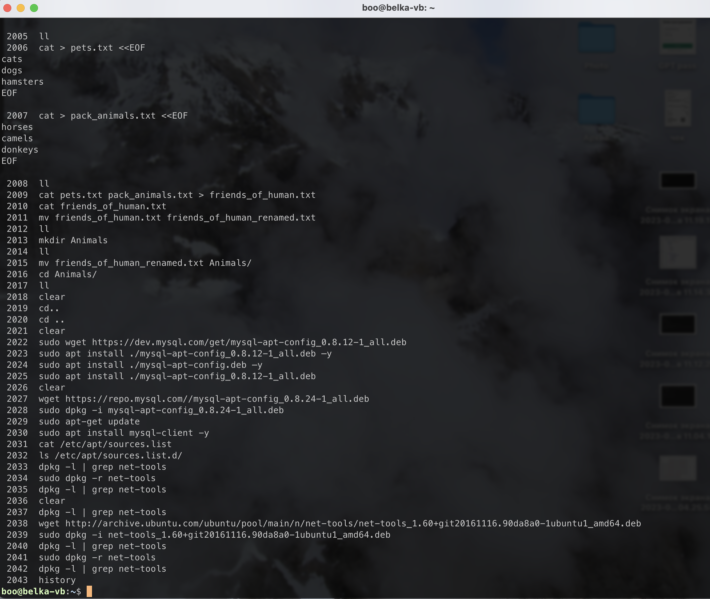

    <h2>
    Блок заданий по Linux
    </h2>

1. Используя команду cat в терминале операционной системы Linux, создать
   два файла Домашние животные (заполнив файл собаками, кошками,
   хомяками) и Вьючные животными заполнив файл Лошадьми, верблюдами и
   ослы), а затем объединить их. Просмотреть содержимое созданного файла.
   Переименовать файл, дав ему новое имя (Друзья человека).

    

        
Выполнение

        

            
        

    

2. Создать директорию, переместить файл туда.

    

    
Выполнение

     

            
        

    

3. Подключить дополнительный репозиторий MySQL. Установить любой пакет
   из этого репозитория.
    

    
Выполнение

    sudo wget https://repo.mysql.com//mysql-apt-config_0.8.24-1_all.deb

    sudo dpkg -i mysql-apt-config_0.8.24-1_all.deb

    sudo apt update

    sudo apt install mysql-client

    >проверка подключенного репозитория

    ls /etc/apt/sources.list.d/

    

4. Установить и удалить deb-пакет с помощью dpkg.
    

    
Выполнение

    dpkg -l | grep net-tools

    wget http://archive.ubuntu.com/ubuntu/pool/main/n/net-tools/net-tools_1.60+git2016111690da8a0-1ubuntu1_amd64.deb

    sudo dpkg -i net-tools_1.60+git20161116.90da8a0-1ubuntu1_amd64.deb

    dpkg -l | grep net-tools

    sudo dpkg -r net-tools

    dpkg -l | grep net-tools

    
    

            
        

    

    

5. Выложить историю команд в терминале ubuntu
    

    
Выполнение

    hystory
        

            
        

    
